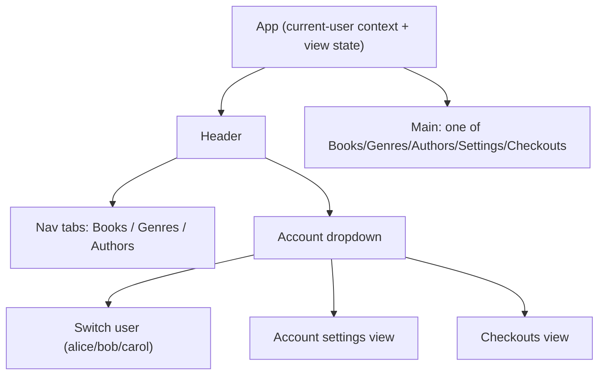

## lbry UI build-out

Two parts: (1) a DB migration splitting `checkout` into active `checkout` + `checkout_history` with a `return_checkout` stored function, and (2) expanding the thin UI ([integration-tests/postgraphile/ui/src/App.jsx](integration-tests/postgraphile/ui/src/App.jsx)) into a small navigable app. Since there is no auth, the "account" is a current-user switcher over the seeded users (alice/bob/carol). Includes mutations to exercise delv's normalized cache.

## Part 1 — Database: split checkout into active + history (v1.001.0)

Follow the per-deploy convention: add a new sqitch change `v1.001.0` (depends on `v1.000.0`) rather than editing v1.000.0. Register it in [db/sqitch.plan](integration-tests/postgraphile/db/sqitch.plan) with a `[v1.000.0]` dependency.

Current [db/deploy/v1.000.0.sql](integration-tests/postgraphile/db/deploy/v1.000.0.sql) has one `lbry.checkout` table with a nullable `returned_at`. After this change: active loans live in `lbry.checkout` (no `returned_at`), returned loans live in `lbry.checkout_history`.

### `db/deploy/v1.001.0.sql`
- Create `lbry.checkout_history` (id uuid pk, `user_id` REF `lbry."user"`, `book_copy_id` REF `lbry.book_copy`, `checked_out_at`, `due_at`, `returned_at timestamptz NOT NULL`, `created_at`, `updated_at`), with FK indexes on `user_id` and `book_copy_id` (per the schema rules: schema-qualified, no cascade, index every FK).
- Backfill: `INSERT INTO lbry.checkout_history (...) SELECT ... FROM lbry.checkout WHERE returned_at IS NOT NULL;` then `DELETE FROM lbry.checkout WHERE returned_at IS NOT NULL;`.
- `ALTER TABLE lbry.checkout DROP COLUMN returned_at;` (active loans never carry it).
- Create the stored function exposed by PostGraphile as a mutation:

```sql
CREATE FUNCTION lbry.return_checkout(checkout_id uuid)
    RETURNS lbry.checkout_history AS $$
DECLARE
    hist lbry.checkout_history;
BEGIN
    INSERT INTO lbry.checkout_history (user_id, book_copy_id, checked_out_at, due_at, returned_at)
    SELECT user_id, book_copy_id, checked_out_at, due_at, now()
    FROM lbry.checkout WHERE id = checkout_id
    RETURNING * INTO hist;

    IF hist.id IS NULL THEN
        RAISE EXCEPTION 'checkout % not found', checkout_id;
    END IF;

    UPDATE lbry.book_copy SET status = 'available', updated_at = now()
    WHERE id = hist.book_copy_id;

    DELETE FROM lbry.checkout WHERE id = checkout_id;
    RETURN hist;
END;
$$ LANGUAGE plpgsql VOLATILE;
```

PostGraphile exposes a VOLATILE function in the served schema as a mutation `returnCheckout(input: {checkoutId: UUID!})` returning a payload with `checkoutHistory` (the inserted row).

### `db/revert/v1.001.0.sql`
Reverse order: `DROP FUNCTION lbry.return_checkout(uuid);` then `ALTER TABLE lbry.checkout ADD COLUMN returned_at timestamptz;`, move rows back (`INSERT INTO lbry.checkout (...) SELECT ..., returned_at FROM lbry.checkout_history;`), `DROP TABLE lbry.checkout_history;`.

### `db/verify/v1.001.0.sql`
`SELECT id FROM lbry.checkout_history WHERE false;` and assert the function exists (`SELECT 'lbry.return_checkout(uuid)'::regprocedure;`).

### Seed + verify updates
- [db/seed.sql](integration-tests/postgraphile/db/seed.sql): add `lbry.checkout_history` to the `TRUNCATE` list; move the one already-returned loan (alice / BC-0001) into a `checkout_history` INSERT; keep the two active loans (bob, carol) in the `checkout` INSERT without `returned_at`.
- [db/verify/v1.000.0.sql](integration-tests/postgraphile/db/verify/v1.000.0.sql) stays as-is (it verifies the v1.000.0 shape).

## Part 2 — UI

### Structure



No router is installed; navigation is simple React state (`view`) in `App`. Current user is a small React context (`{userId, setUserId}`) provided by `App`, defaulting to the first user returned.

### Files (under `integration-tests/postgraphile/ui/src/`)

- `queries.js` (new): all query/mutation strings in one place.
- `components/Books.jsx`, `components/Genres.jsx`, `components/Authors.jsx` (new): read-only lists via `DelvQuery`.
- `components/AccountMenu.jsx` (new): dropdown button (shows current user's `fullName`), user-switch list, and links to Settings/Checkouts.
- `components/AccountSettings.jsx` (new): loads the current user, form to edit `fullName`/`email` via `useMutation`.
- `components/Checkouts.jsx` (new): current user's active checkouts via `DelvQuery` with a "Return" button per row (`useMutation(RETURN_CHECKOUT)` + `refetchQueries`), plus a history section via `DelvQuery(CHECKOUT_HISTORY_QUERY)`.
- `App.jsx` (rewrite): header (title + nav + `AccountMenu`), view switching, current-user context.

Keep repo JS style: no semicolons, arrow functions. Reuse existing loading/error inline patterns from `App.jsx`.

### GraphQL (in `queries.js`)

Existing `BOOKS_QUERY` / `AUTHORS_QUERY` move here unchanged. Add:

- `GENRES_QUERY`: `allGenres { nodes { id name booksByGenreId { nodes { id title } } } }` (books-per-genre so the view is meaningful).
- `USERS_QUERY`: `allUsers { nodes { id username fullName email } }` (dropdown + settings).
- `CHECKOUTS_QUERY($userId: UUID!)` (active): `allCheckouts(condition: {userId: $userId}) { nodes { id checkedOutAt dueAt bookCopyByBookCopyId { id barcode status bookByBookId { id title } } } }` (no `returnedAt` — active table dropped it).
- `CHECKOUT_HISTORY_QUERY($userId: UUID!)`: `allCheckoutHistories(condition: {userId: $userId}) { nodes { id checkedOutAt dueAt returnedAt bookCopyByBookCopyId { id barcode bookByBookId { id title } } } }` (PostGraphile pluralizes `checkout_history` -> `allCheckoutHistories`).
- `USERS_QUERY`: (as above).
- `UPDATE_USER($id: UUID!, $patch: UserPatch!)`: `updateUserById(input: {id: $id, userPatch: $patch}) { user { id username fullName email } }`.
- `RETURN_CHECKOUT($checkoutId: UUID!)`: `returnCheckout(input: {checkoutId: $checkoutId}) { checkoutHistory { id returnedAt userId } }` — calls the v1.001.0 stored function; no client-side timestamp needed.

CRITICAL formatting rule (delv network layer): `AxiosWithErrors.post` does `query.replace(/{(\n)/g,'{\n__typename\n')`, so any `{` immediately followed by a newline gets `__typename` injected. That's fine for selection sets but breaks GraphQL input objects. So:
- Keep every selection-set `{` on its own line followed by a newline (as the current queries do) so normalization works.
- Keep mutation `input: {...}` braces INLINE and pass the mutable fields as a variable (`$patch: UserPatch!` / `$patch: CheckoutPatch!`) so no `__typename` is injected into an input object.

### Mutations / cache behavior

- Account settings `updateUserById` returns the updated `user` node; delv's normalized cache updates the dropdown label and any user-bound view automatically (no refetch needed).
- Return a book: `returnCheckout` moves the row from `checkout` to `checkout_history` (list membership changes in BOTH lists), so the returned checkout node update alone is not enough. Pass `refetchQueries: [{query: CHECKOUTS_QUERY, variables: {userId}}, {query: CHECKOUT_HISTORY_QUERY, variables: {userId}}]` to `useMutation` so the active list drops the row and the history list gains it.

### Verification

`cd integration-tests/postgraphile && make db-reset` deploys `v1.000.0` + `v1.001.0`, verifies, and seeds cleanly (checkout_history populated with alice's returned loan; bob/carol active). `make install && make up`, open http://localhost:8080: Books/Genres/Authors render live; the account dropdown switches user (alice/bob/carol) and both the active Checkouts and history update per user; editing profile in Account Settings persists and updates the dropdown; clicking Return moves a loan from active to history (via `returnCheckout`) and both lists reflect it. GraphiQL should show a `returnCheckout` mutation. `make ui-dev` also works standalone (vite proxies `/graphql`).
</plan>
<todos>[{"id": "db-migration", "content": "Add sqitch change v1.001.0 (deploy/revert/verify + sqitch.plan line with [v1.000.0] dep): create lbry.checkout_history, backfill returned loans, drop checkout.returned_at, and add lbry.return_checkout(uuid) VOLATILE function"}, {"id": "db-seed", "content": "Update db/seed.sql: add checkout_history to TRUNCATE, move alice's returned loan into a checkout_history INSERT, keep bob/carol as active checkout rows without returned_at"}, {"id": "queries", "content": "Create src/queries.js with BOOKS/AUTHORS (moved), GENRES, USERS, CHECKOUTS (active), CHECKOUT_HISTORY queries and UPDATE_USER, RETURN_CHECKOUT (returnCheckout) mutations; keep selection-set braces newline-terminated and mutation input objects inline with variables"}, {"id": "list-views", "content": "Create components/Books.jsx, components/Genres.jsx, components/Authors.jsx using DelvQuery with loading/error handling"}, {"id": "account-menu", "content": "Create components/AccountMenu.jsx: dropdown showing current user's fullName, user-switch list (from USERS_QUERY), and links to Settings and Checkouts views"}, {"id": "settings", "content": "Create components/AccountSettings.jsx: load current user, edit fullName/email form wired to useMutation(UPDATE_USER)"}, {"id": "checkouts", "content": "Create components/Checkouts.jsx: active checkouts via DelvQuery(CHECKOUTS_QUERY) with per-row Return button via useMutation(RETURN_CHECKOUT) + refetchQueries for active+history; history section via DelvQuery(CHECKOUT_HISTORY_QUERY)"}, {"id": "app-shell", "content": "Rewrite App.jsx: current-user React context (default first user), header with title + Books/Genres/Authors tabs + AccountMenu, and view switching for the five views"}]