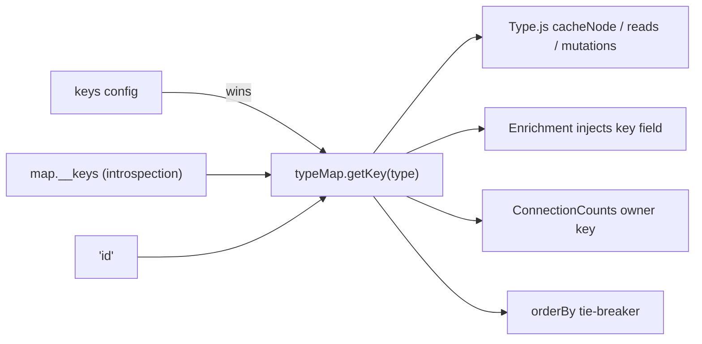

# Per-type cache keys in the TypeMap

## Key resolution

`getKey(type)` returns `keys[type]`, then `map.__keys[type]`, then `'id'`. The default for every type that already has an `id` stays the same.

## 1. Detection in [src/queryManager/Postgraphile.js](src/queryManager/Postgraphile.js)

In `_loadIntrospection`, build `map.__keys`. The introspection query already requests `args`.

- **Candidates:** only check types the cache would actually normalize. A type counts if it is a value in the relationship map (including `Query`) and has no `id` field. This filters out payloads, `PageInfo` and unrelated object types, and keeps the existing "no logging" test at line 140 passing.
- **Lookups:** for each candidate, find the `Query` fields that return that type and take exactly one argument. The argument must be `NON_NULL` and named after a scalar field of the type, and it can't be `nodeId`. For example, `entityTypeByType(type: String!)` gives `EntityType -> 'type'`.
- **Only exactly one lookup enables a key.** Otherwise the type is left out of `__keys` and one line is logged per type:
  - no single-column lookup (composite key, no unique key, or a view): `delv: EntityRelationshipType has no id and no single-column lookup; it will not be cached. Set keys.EntityRelationshipType in TypeMap config.`
  - more than one lookup: `delv: Foo has multiple single-column lookups (fooByA, fooByB); it will not be cached. Set keys.Foo ...`
- `__keys` is a plain property on the map, so it survives `JSON.stringify`. That way prebuilt maps keep the detected keys.

## 2. Config in the same file

- Add a `keys = {}` option to `TypeMap({typeMap, api, fields, keys})`. For example, `TypeMap({typeMap, keys: {EntityRelationshipType: 'relationship'}})`.
- Expose `getKey(type)` on the returned object.
- Merge `keys` into `__keys` inside `toString()`, the same way `fields` is merged, so the serialized map reflects the config.
- **Validation:** when field metadata exists (`getFields(type)` is non-empty) and a configured key isn't one of the type's fields, log `delv: keys.X = 'y' is not a field of X`.

The API mode (`TypeMap({api})`) returns the raw map, not the wrapper. Keys configured there are applied when the result is wrapped with `TypeMap({typeMap: map, keys})`, matching how `fields` already works.

## 3. Consumers (replace the hardcoded `'id'`)

Everywhere below, `keyOf = (type) => typeMap.getKey ? typeMap.getKey(type) : 'id'`, so old or handwritten type maps behave the same as before.

- [src/cache/policy/Type.js](src/cache/policy/Type.js): remove `UID` and add a local `keyOf`. The places that currently read `UID` change as follows:
  - `mutationEntities` (line 55): read `node[keyOf(node.__typename)]`.
  - `cacheNode`'s key lookup (line 262): read `node[keyOf(type)]`.
  - reverse references (lines 287-288): read `parent[keyOf(parentType)]`.
  - the reverse merge (line 291): write `[keyOf(type)]: id`.
  - single-record membership (line 336): read `value[keyOf(value.__typename)]`.
  - Add `getKey: (node) => node[keyOf(node.__typename)]` to `access`.
- [src/cache/ConnectionCounts.js](src/cache/ConnectionCounts.js): take a `keyOf` argument and use `owner[keyOf(owner.__typename)]` instead of `owner.id`. Update the constructor call in `Type.js` to `require('../ConnectionCounts')(storage, keyOf)`.
- [src/cache/Filter.js](src/cache/Filter.js): the tie-breaker at lines 120-121 uses `access.getKey` when present and falls back to `UID`.
- [src/queryManager/Enrichment.js](src/queryManager/Enrichment.js): line 104 becomes "add `getKey(type)` if the type has that field", so queries automatically select the key column the same way they currently select `id`.

## 4. Tests

- [__test__/queryManager/Postgraphile.test.js](__test__/queryManager/Postgraphile.test.js), using mocked introspection types:
  - one lookup detects the key
  - types with `id` get no `__keys` entry
  - two lookups log and set no key
  - a two-argument composite lookup logs and sets no key
  - `keys` overrides detection and shows up in `toString()`
  - an invalid configured key logs
  - the existing round-trip and no-log tests still pass
- New `__test__/cache/CustomKeys.test.js`, with `EntityType` keyed by `type`, checking:
  - a list re-read returns the records
  - a nested `entityTypeByType` resolves
  - a single-record lookup re-reads from cache
  - create and delete mutations update membership
  - a configured key works for a type without detection
- The Enrichment test checks that the key column is injected for a keyed type.

## 5. Docs

Add a short README section on cache keys: `id` is the default, the detection rule, the `keys` config, and what the log lines mean.
