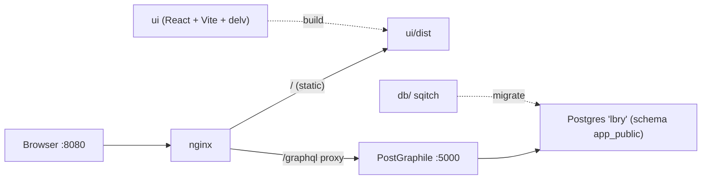

## Postgraphile integration test ("lbry" library app)

Build a runnable, native (no Docker) integration app that exercises delv against a real PostGraphile API. Orchestration via POSIX-sh Makefiles; auth stays plain (role tables exist, no RLS/JWT yet). JS follows repo rules: no semicolons, arrow functions.

### Layout (all under `integration-tests/postgraphile/`)

### 1. Database — `db/` (sqitch, project `lbry`, engine pg)
Existing `sqitch.conf`/`sqitch.plan` are stubs. Versioning is per-deployment: one sqitch change per deploy. Since this service hasn't shipped, the entire initial schema goes into a single change `v1.000.0` (`deploy/v1.000.0.sql`, `revert/v1.000.0.sql`, `verify/v1.000.0.sql`, one `sqitch.plan` line). Future deployments add `v1.001.0`, etc. All tables in schema `app_public`, `id uuid primary key default gen_random_uuid()` (PG16 built-in), plus `created_at`/`updated_at timestamptz default now()`. FK relations give PostGraphile forward + reverse connections for delv to normalize.

`deploy/v1.000.0.sql` creates, in dependency order:
- schema `app_public`
- state (name, code) → city (name, state_id) → library (name, address, city_id)
- genre (name) ; author (first_name, last_name, bio)
- book (title, isbn, published_date, genre_id, author_id)
- book_copy (book_id, library_id, barcode, status) — physical copies so checkouts are realistic (extra table)
- user (username, email, full_name) ; account (name)
- user_accounts (user_id, account_id) join
- role (name) master table (extra, so role joins have a target)
- user_roles (user_id, role_id) ; account_roles (account_id, role_id) joins
- checkout (user_id, book_copy_id, checked_out_at, due_at, returned_at)

`revert/v1.000.0.sql` drops schema `app_public` cascade; `verify/v1.000.0.sql` asserts the key tables exist.

Plus `db/seed.sql` (not a versioned change) with a handful of states/cities/libraries/authors/books/copies/users/roles/checkouts for the UI to render.

### 2. API — `services/lbry/`
`package.json` (deps: `express`, `postgraphile`, `pg`) + `index.js`: Express mounting `postgraphile(DATABASE_URL, 'app_public', { watchPg: true, graphiql: true, enhanceGraphiql: true, graphqlRoute: '/graphql' })`, listening on `:5000`, reading `DATABASE_URL` (default `postgres:///lbry`). No CORS needed (same-origin via nginx).

### 3. nginx — `services/nginx/nginx.conf`
`listen 8080`; `location /graphql` → `proxy_pass http://127.0.0.1:5000` (keep `/graphql`); `location /` → `root ../../ui/dist` with SPA `try_files ... /index.html`. Runnable via `nginx -c` with an absolute-path config generated/pointed by the Makefile (nginx needs abs paths; Makefile passes `-p`/prefix).

### 4. UI — `ui/` (Vite + React, consumes delv)
- `package.json`: `react`, `react-dom`, `delv: file:../../..`, dev dep `vite`, `@vitejs/plugin-react`.
- `vite.config.js`: react plugin; dev `server.proxy` `/graphql` → `http://127.0.0.1:5000` so `vite dev` also works standalone.
- `src/delv.js`: build client with `AxiosWithErrors({url: '/graphql'})`, `createCache`, `QueryManager`, all four network policies; dev-mode `TypeMap({api: '/graphql'})` introspection (async) to avoid committing a typemap now (note: swap to prebuilt `typemap.json` later).
- `src/main.jsx` + `src/App.jsx`: `DelvProvider` + a minimal `useQuery` list of books/authors. Intentionally thin — to be expanded by later prompts to cover queries, mutations, `useMutation`, refetch, policies.

### 5. Orchestration — Makefiles (POSIX sh)
Top `Makefile` (with `SHELL := /bin/sh`) plus small per-service targets. Vars: `PGDATABASE=lbry`, `DATABASE_URL=postgres:///lbry`, `API_PORT=5000`, `HTTP_PORT=8080`.
- db: `db-create` (`createdb`), `db-deploy`/`db-verify`/`db-revert` (sqitch against `db:pg:$(DATABASE_URL)`), `db-seed` (`psql -f db/seed.sql`), `db-reset` (dropdb+create+deploy+seed).
- deps: `install` → api `npm install`, ui `npm install`.
- run: `api` (`node services/lbry`), `ui-dev` (`vite`), `ui-build` (`vite build`), `nginx` (start), `nginx-stop`.
- `up` = db-reset + build UI + start api + start nginx; `down` = stop api + nginx.
- A short `README.md` documenting `make install && make db-reset && make up` then open `http://localhost:8080`.

### Verification
`make db-reset` deploys + verifies + seeds clean; `make up` serves the UI at `:8080` with `/graphql` proxied; GraphiQL reachable; the UI's book/author list renders live data through delv.

### Notes / decisions
- Vite chosen for the UI (fast, handles delv's CommonJS `exports` via esbuild interop).
- `book_copy` and `role` added beyond the listed tables so `checkout` and the `*_roles` joins have proper targets.
- Auth deferred: role tables exist but no RLS/JWT; PostGraphile runs open for now.
- Seed data lives outside sqitch so migrations stay pure schema.