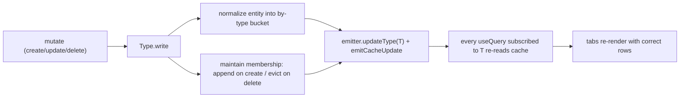

## Goal

Every catalog tab (Books, Genres, Authors) gets create / update / delete, and each mutation updates the visible lists purely via delv's cache event emitter - no `refetchQueries`. Update already works via normalization; this plan makes create and delete work the same way by teaching the cache to maintain collection membership on mutations.

## Why the library needs a change first

`useQuery` already subscribes to type-change events and re-reads on any relevant type change ([src/react/delv-react.js](src/react/delv-react.js) lines 72-101). The blocker is the authoritative "collection membership" list that `read` replays ([src/cache/policy/Type.js](src/cache/policy/Type.js) lines 47-56): mutations never update it, and delete has no eviction. Membership is load-bearing (Checkouts filters by a `userId` not in its selection set), so we maintain it rather than remove it.

## Library changes (delv core)

### 1. Working eviction in the store - [src/cache/storage/InMemoryStore.js](src/cache/storage/InMemoryStore.js)
- Add a real `delete` to `StoreType` (e.g. `const del = (key) => { delete store[key] }`) and expose it.
- Fix `removeAbsolute` (line 54) to `delete store[id]`, and add `evict(id, type)` that removes an id from a type bucket.

### 2. Mutation-aware membership maintenance - [src/cache/policy/Type.js](src/cache/policy/Type.js) `write`
- Parse the operation's root field name from the mutation string (reuse the existing `gql\`${query}\`` pattern already used in `queryKey`). Classify by PostGraphile naming: `create*`, `delete*`, `update*`.
- Iterate all recorded collection keys. To do that, add a small registry: on the existing membership-recording branch (lines 210-219), also track each recorded `collectionKey` and its `childType` (e.g. keep a `Map` of collectionKey -> childType inside the closure, or store a companion absolute key). This avoids scanning opaque storage.
- On `create*`: after normalization, take the newly cached entity id(s) and append to every recorded membership whose `childType` matches. Read-time `applyCondition`/`applyWhere`/`applyOrderBy` already run against membership nodes (lines 66-81), so filtered/ordered lists self-correct. Then `emitter.updateType(childType)`.
- On `delete*`: read the returned node's real `id` from the payload (we select `{ id __typename }`), evict it from the bucket and from every recorded membership of that type, then `emitter.updateType(childType)`.
- `update*` / default: unchanged (merge + emit already works).
- Normal queries are unaffected: their root fields (`allBooks`, etc.) match none of the prefixes and keep recording membership.

### Known limitations to note (not blockers for these tabs)
- A brand-new book won't appear under its genre's nested `booksByGenreId` list until that genre is refetched (reverse relation arrays aren't back-patched); it does appear on the Books tab.
- Deleting a seeded row that has dependents (FK `NO ACTION`) returns a DB error surfaced in the UI - the clean delete demo is: create a row, then delete it.

## UI changes (integration-tests/postgraphile/ui)

### 3. Mutation strings - [ui/src/queries.js](integration-tests/postgraphile/ui/src/queries.js)
Add, following the existing inline-`input:{...}` rule (keep input braces inline, pass values via variables, selection-set braces on their own line):
- Books: `CREATE_BOOK` (`createBook(input: {book: $book})`), `UPDATE_BOOK` (`updateBookById(input: {id: $id, bookPatch: $patch})`), `DELETE_BOOK` (`deleteBookById(input: {id: $id}){ book { id __typename } }`).
- Genres: `CREATE_GENRE`, `UPDATE_GENRE`, `DELETE_GENRE`.
- Authors: `CREATE_AUTHOR`, `UPDATE_AUTHOR`, `DELETE_AUTHOR`.
- Book create/update payloads select the same fields as `BOOKS_QUERY` (title, isbn, publishedDate, author + genre relations) so the normalized entity is complete for cross-tab propagation.

### 4. Books tab - [ui/src/components/Books.jsx](integration-tests/postgraphile/ui/src/components/Books.jsx)
- Add a "New book" form (title + author dropdown + genre dropdown, using authors/genres already fetched via `useQuery`) wired to `CREATE_BOOK`.
- Per row: inline edit of title -> `UPDATE_BOOK` (the headline cache demo - the change also shows under the book's genre on the Genres tab), and a Delete button -> `DELETE_BOOK`.
- All via `useMutation`; no `refetchQueries`.

### 5. Genres tab - [ui/src/components/Genres.jsx](integration-tests/postgraphile/ui/src/components/Genres.jsx)
- New-genre form (`name`), inline rename (`UPDATE_GENRE` - renaming propagates to the `(genre)` label on the Books tab), delete button.

### 6. Authors tab - [ui/src/components/Authors.jsx](integration-tests/postgraphile/ui/src/components/Authors.jsx)
- New-author form (firstName, lastName, bio), inline edit, delete. Renaming an author propagates to that author's byline on the Books tab (cross-tab showcase).

### Existing tabs
Account settings (`UPDATE_USER`) and Checkouts (`RETURN_CHECKOUT`) already have mutations. Leave Checkouts' `refetchQueries` in place - `returnCheckout` is a custom function (not a `create*`/`delete*` prefix) that moves a row between two tables, which the auto membership-maintenance intentionally does not cover.

## Verify
- `npm test` at repo root - existing Jest suite (Cache, policies, delv, delv-react) still passes; add/adjust a cache test proving create appends and delete evicts membership with a type event.
- Rebuild UI (`cd integration-tests/postgraphile && make ui.build`) and in-browser confirm, with no `refetchQueries`: creating a genre makes it appear on Genres; renaming an author updates both Authors and the Books bylines; deleting a just-created row removes it live.

## Conventions
JavaScript: no semicolons, arrow functions only. SQL untouched. Any shell is POSIX/Bourne.