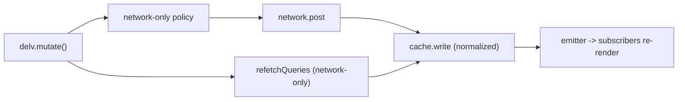

# Wire in mutations

## Problem
[src/core/Mutation.js](src/core/Mutation.js) is dead and broken: it calls `Delv.query(...)` as if `Delv` were a singleton, but `Delv` is a factory returning an object. It is not exported from [src/index.js](src/index.js), has a `cacheProcess = 'defualt'` typo, and defaults to an unregistered `'default'` cache process. There are no tests.

## Approach
A mutation is essentially a `network-only` request whose response is written into the type-normalized cache. Because the cache is normalized, writing the mutated node(s) automatically updates every query that touched those types via the existing emitter/`subscribe` path (this is the library's core value prop). `refetchQueries` covers cases the response can't (deletes, list membership changes).

The idiomatic fit is a client method `delv.mutate(...)` alongside `delv.query(...)`, routed through the already-registered network policies.

## Changes

### 1. Add `mutate` to the client factory — [src/core/delv.js](src/core/delv.js)
Add a `mutate` method and include it in the returned object. Signature: `mutate({mutation, variables, refetchQueries = [], networkPolicy, cacheProcess, ...other})`.
- Resolve policy name defaulting to `'network-only'`; throw the same `Unknown network policy: "<name>"` error if not registered (consistent with `query`).
- `await policy.process({query: mutation, variables, cacheProcess: cacheProcess || defaultCacheProcess, ...other})` to get the mutation data (policy already writes the response to the cache).
- After it resolves, run `refetchQueries` through their policies (each entry `{query, variables, networkPolicy, cacheProcess}`, defaulting to `network-only`), `await Promise.all(...)`; swallow individual refetch errors so a refetch failure never masks a successful mutation.
- Return the mutation data.

### 2. Remove the broken standalone helper
- Delete [src/core/Mutation.js](src/core/Mutation.js) (unused, not exported, superseded by `delv.mutate`).
- Remove the `"!src/core/Mutation.js"` entry from `collectCoverageFrom` in [package.json](package.json).

### 3. Add React `useMutation` hook — [src/react/delv-react.js](src/react/delv-react.js)
- `useMutation(config = {}, clientOverride)` returning a tuple `[mutate, {loading, data, error}]` (Apollo-style).
- `config` holds `{mutation, variables, refetchQueries}`; the returned `mutate(runtime = {})` merges `{...config, ...runtime}` (so callers can pass per-call `variables`) and calls `client.mutate(...)`.
- Track `loading`/`data`/`error` with `useState`, guard `setState` with a `mountedRef`, and re-throw on error so callers can `try/catch`.
- Reuse the existing `no Delv client found` guard. Export `useMutation` from the module's export list.

### 4. Tests
- [__test__/core/delv.test.js](__test__/core/delv.test.js): extend the existing `makePolicy`/`setup` harness. Cover: routes to `network-only` by default; honors an explicit `networkPolicy`; passes resolved `cacheProcess`; runs each `refetchQueries` entry through the right policy; returns the mutation data; rejects/throws on an unknown policy; a failing refetch does not reject the mutation.
- [__test__/react/delv-react.test.js](__test__/react/delv-react.test.js): add a `useMutation` block using the existing `createClient` helper (add a `mutate` mock). Cover: initial `loading:false`; `loading` toggles then resolves with `data`; error path sets `error` and rejects; runtime `variables` override reaches `client.mutate`.

### 5. Docs — [README.md](README.md)
Add a "Mutations" section documenting `delv.mutate({mutation, variables, refetchQueries})` and the `useMutation` hook, noting that the normalized cache auto-updates matching queries and that `refetchQueries` is for cases the response can't cover (e.g. deletes / list membership).

## Verification
Run `npx jest --coverage`; all suites (existing 66 + new) pass and `Mutation.js` no longer appears as an excluded/uncovered file.

## Notes / decisions
- Routing through the registered `network-only` policy (rather than calling `network.post` directly) reuses tested code and matches the original author's intent. Trade-off: the QueryManager dedupes concurrent *identical* mutations; acceptable and consistent with existing policy behavior.
- Including the React `useMutation` hook rounds out the feature for the library's React surface; it can be dropped from scope if you only want the client method.