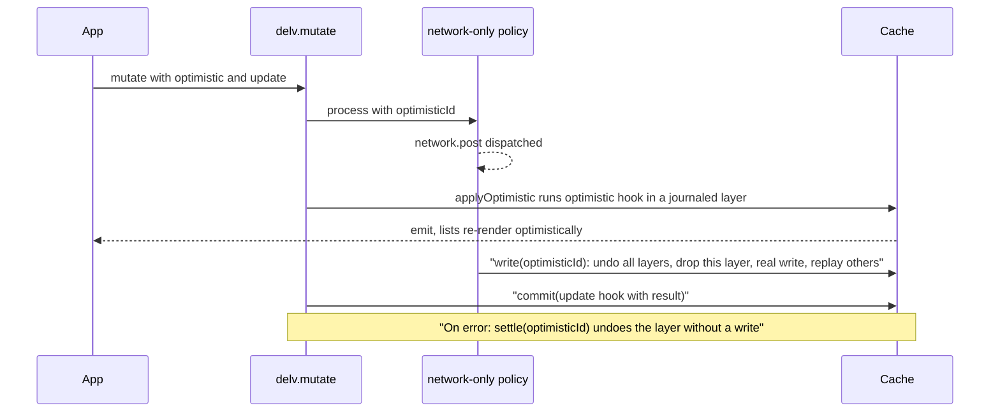

# Optimistic mutation hooks with cache helpers

## Usage

```js
delv.mutate({
    mutation: CREATE_BOOK,
    variables: {book},
    optimistic: ({cacheByType, cache, mutation, variables, typeMap}) => {
        cacheByType.write('Book.temp-1', {title: book.title, author: {id: book.authorId}})
    },
    update: ({cacheByType, cache, result, mutation, variables}) => {
        cacheByType.delete('Checkout', result.returnCheckout.checkout.id)
    }
})
```

Both helper objects share the same signatures:
- `read('Type.id')` returns the stored entity.
- `write('Type.id', values)` works like an insert: it creates the entity or merges into it.
- `update('Type.id', values)` works like an update: it merges into an existing entity. On the raw `cache` it returns `false` and does nothing when the entity is missing.
- `delete('Type', id)` also accepts `delete('Type.id')`.

References are split at the first `.`. If the type map says the key field is `Int`, the id is converted to a number.

The difference between the two objects:
- **`cache` (raw, dangerous):** it runs `storage.merge` / `storage.evict` on that one entity, stamps `__typename` and the key field, and marks the type as changed. It does no normalization and no reverse references. It also does not touch membership: list membership is left alone, and reads simply filter out deleted ids.
- **`cacheByType` (full):** it builds `{...values, __typename, [key]: id}` and fills in any missing `__typename` on nested relation objects from the type map. It then runs this through the policy's existing `cacheNode`, which handles nested normalization and reverse references. `write` then appends the id to recorded collections, `delete` evicts it from them, and `update` makes no membership change. These are the same paths that `create*`, `delete*`, and `update*` mutations use today.

## Lifecycle



**Why replay is needed:** optimistic changes are applied to the real store, with an undo journal. Any write to the base store while layers are pending would be lost when a layer is later undone. To prevent that, every base write goes through `rebase`: undo all pending layers, then write, then replay the layers. When nothing is pending, `rebase` is a plain call, so there is no cost in the common case.

## Changes

- **New [src/cache/Journal.js](src/cache/Journal.js):** a proxy around storage.
  - While `record(fn)` is running, it captures the value each entity had the first time it is touched (`merge`, `set`, `evict`), whether its type bucket already existed, and the prior values of `setAbsolute` / `removeAbsolute`.
  - `undo()` restores those values. A bucket created by the layer is removed completely, so cache-miss behavior is preserved. `undo()` returns the touched types.
- **New [src/cache/Optimistic.js](src/cache/Optimistic.js):** a stack of layers `{id, fn, context, undo}` with these operations:
  - `apply(id, fn, context)`: if `fn` throws, undo the partial layer and log with `console.error`.
  - `rebase(fn)`
  - `settle(id, fn?)`
  - `clear()`
  - `isRecording()`

  Each operation runs inside `emitter.batch` so subscribers see one final state.
- **New [src/cache/CacheHelpers.js](src/cache/CacheHelpers.js):** builds `{cache, cacheByType}` from storage, emitter, typeMap and the type policy. Each call runs directly while a layer is recording; otherwise it runs through `layers.rebase`.
- **[src/cache/CacheEmitter.js](src/cache/CacheEmitter.js):** add `batch(fn)`, a depth counter. While inside a batch, `emitCacheUpdate` only accumulates types. One emit happens when the outermost batch exits.
- **[src/cache/policy/Type.js](src/cache/policy/Type.js):**
  - Add `writeEntity({action, type, id, values})`, which reuses `cacheNode`, `appendMembership` and `evictMembership`.
  - Make `appendMembership` / `evictMembership` copy-on-write (`storage.setAbsolute(colKey, next)` instead of `push` / `splice`) so the journal can undo them.
  - Compare ids with `String()` so `'5'` matches `5`.
- **[src/cache/Cache.js](src/cache/Cache.js):**
  - Wrap storage in the Journal before building policies.
  - `write` strips `optimisticId`, then calls `layers.settle(optimisticId, policyWrite)` or `layers.rebase(policyWrite)`.
  - `clear` also clears the layers.
  - Expose `applyOptimistic`, `settleOptimistic`, `commit` (which is `rebase`) and `helpers()`.
- **[src/core/delv.js](src/core/delv.js):**
  - `mutate` destructures `optimistic` and `update` so they never leak into `...other`.
  - `optimisticId` is only added to the `process` arguments when `optimistic` is set, so existing `toHaveBeenCalledWith` tests still pass.
  - The optimistic hook runs right after `process()` returns its promise, which is after `network.post` has been dispatched.
  - On rejection, call `settleOptimistic` and rethrow.
  - On success, run `cache.commit(() => update({...helpers, result, mutation, variables, typeMap}))`. Errors in `update` are logged, not thrown, because the server write already succeeded.
  - Expose `cache` and `cacheByType` on the client for use outside mutations.
- **[src/react/delv-react.js](src/react/delv-react.js):** `useMutation` keeps `config` in a ref. Otherwise the hook functions go stale: `JSON.stringify(config)` drops functions from the dependency key.

## Tests

- New `__test__/cache/CacheHelpers.test.js`:
  - Raw operations emit types and do not touch membership.
  - `cacheByType.write` appends to a recorded collection, normalizes nested relations and sets reverse references.
  - `delete` evicts.
  - `update` merges.
- New `__test__/cache/Optimistic.test.js`:
  - A read shows the optimistic data.
  - After a successful settle, the temporary entity is gone and the real one is present.
  - After an error settle, the cache is restored, and a bucket created by the layer gives a cache miss again.
  - With overlapping layers, settling A replays B on top of real A.
  - A base write made while a layer is pending survives that layer's undo.
- `__test__/core/delv.test.js`:
  - The hook runs after `network.post` and before the response.
  - `update` receives `result`.
  - Rejection rolls back.
  - Existing assertions are unchanged.
- `__test__/react/delv-react.test.js`: a list re-renders with optimistic data before the mutation resolves.

## Docs

Add an "Optimistic updates" section to [README.md](README.md) and [docs/cache-design.md](docs/cache-design.md). It covers the raw versus byType helpers, rollback and replay semantics, and a warning that raw `cache` writes skip normalization and membership.